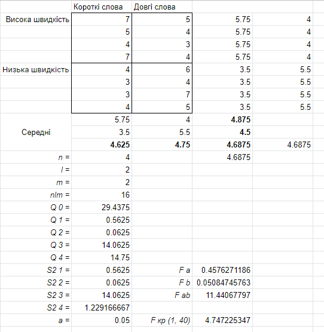

Оскільки Fa < Fкр та Fb < Fкр, то вплив фактора швидкості пред'явлення слів і фактора довжини слів на показники їх відтворення не є статистично значущими. Однак оскільки Fab > Fкр, то можна стверджувати, що вплив фактора швидкості пред'явлення слів змінюється залежно від фактора довжини слів, і навпаки.
